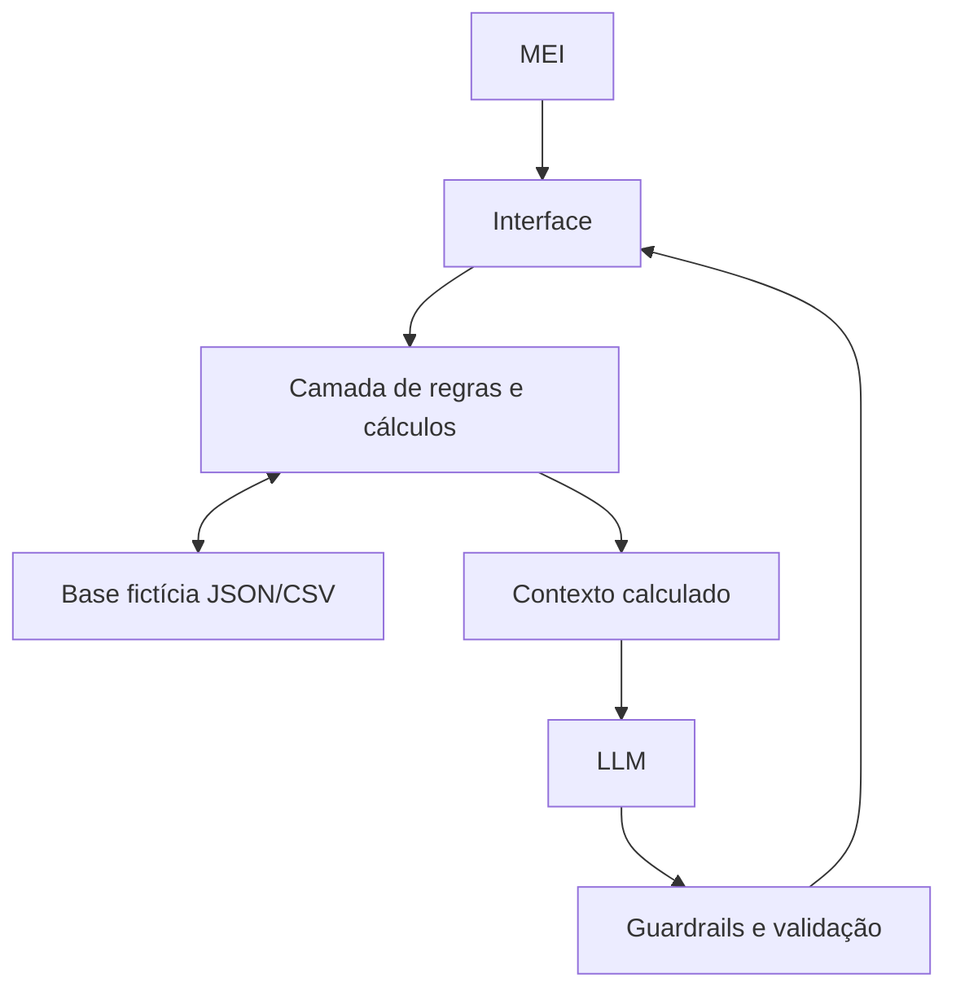

# Etapa 1 — Documentação do Agente

> **Estado:** Gate 1 concluído por decisões autorais aprovadas.  
> **Natureza:** rascunho de trabalho; não é declaração de submissão.  
> **Backfill documental:** 23/09/2026 — completude reconciliada com o template oficial usando somente decisões já aprovadas por Otávio.

## Caso de Uso

### Problema

O MEI não consegue enxergar com clareza o caixa real do negócio e, por isso, tem dificuldade para avaliar se uma retirada, compra ou crédito cabe financeiramente.

### Solução

A MILA organiza movimentações pessoais e empresariais, ajuda a reconstruir e projetar o caixa do negócio, mostra o impacto de decisões e compara cenários de crédito sem decidir pelo usuário.

### Público-Alvo

MEIs prestadores de serviços com baixa familiaridade com gestão financeira, especialmente os que misturam movimentações pessoais e empresariais.

## Persona e Tom de Voz

### Nome do Agente

**MILA — MEI Inteligente para Liquidez e Autonomia**

### Personalidade

Simples, direta, educativa, não julgadora e voltada a apoiar decisões sem substituir o usuário.

### Tom de Comunicação

Acessível, curto e cotidiano. Evita jargão; quando um termo técnico for necessário, explica em palavras simples.

### Exemplos de Linguagem já aprovados

- **Dado insuficiente:** “Posso te ajudar a entender se ele cabe no seu caixa, mas ainda falta uma informação. Qual é o valor da parcela?”
- **Segurança:** “Não. Nunca envie sua senha, token ou código de acesso.”
- **Ambiguidade:** quando não houver contexto suficiente para PF/PJ, manter a movimentação como `PENDENTE` e fazer uma pergunta objetiva.

## Arquitetura Conceitual

### Componentes

| Componente | Descrição |
|---|---|
| Interface | A definir no Gate 4; recebe perguntas e apresenta respostas |
| Camada de regras e cálculos | Executa classificações confirmadas, saldo, projeções, parcelas e rateios determinísticos |
| Base de Conhecimento | `perfil_mei.json`, `transacoes.csv`, `compromissos.csv` e `propostas_credito.csv` |
| LLM | Modelo a definir no Gate 4; explica o contexto calculado em linguagem simples |
| Validação | Impede invenção de números, mantém ambiguidades como `PENDENTE` e aplica limites de escopo |

A **stack técnica permanece pendente** e será definida no Gate 4. O diagrama descreve responsabilidades, não uma tecnologia específica.

## Segurança e Anti-Alucinação

### Estratégias Adotadas

- usar somente dados disponíveis e confirmados;
- nunca inventar saldo, taxa, data, parcela ou classificação;
- manter `PENDENTE` quando não houver evidência suficiente;
- deixar os cálculos determinísticos na aplicação;
- sinalizar claramente simulações;
- pedir uma informação objetiva por vez quando faltar dado essencial;
- não solicitar senha, token, credencial bancária ou dado sensível desnecessário;
- explicar resultados em linguagem simples;
- comparar crédito sem ordenar contratação.

### Limitações Declaradas

A MILA não movimenta dinheiro, não contrata crédito, não recomenda instituição específica, não afirma que uma oferta é a melhor do mercado sem fonte atual verificável e não substitui orientação contábil, jurídica ou financeira profissional/regulada.

## Caso Principal de Demonstração

MEI eletricista autônomo avaliando aquisição financiada de equipamento e comparando condições fictícias de crédito com custos e datas de vencimento diferentes.

## Estado do Gate 1

`GATE_1=CONCLUIDO_COM_APROVACAO_AUTORAL`

O backfill de 23/09/2026 corrigiu a **completude documental** do arquivo sem alterar a cronologia das decisões nem criar nova decisão substantiva.
